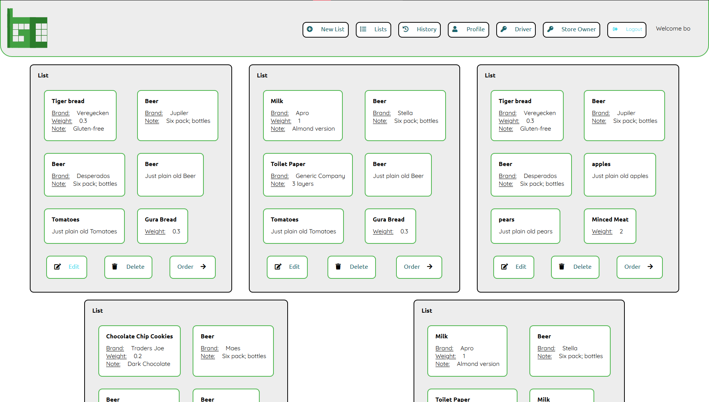
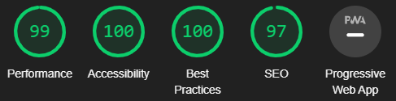
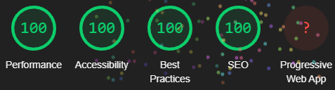
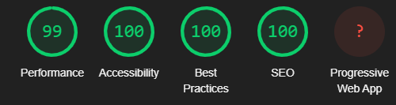
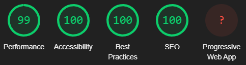
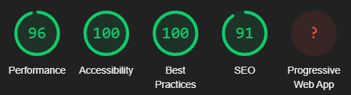
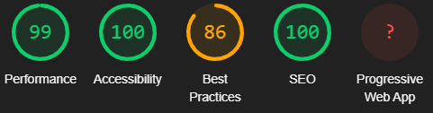

# Introduction
Welcome to the **Grocart** Repository, powered by **[Laravel](https://laravel.com/)**, the PHP framework for Web Artisans.

Grocart is a remote shopping service that allows you to keep track of the groceries you need and order them with ease, thanks to our list system.
## Before we dive in...
This repo contains the consumer side of the application. If a link links to the *Under Construction* page, this means that the page was out-of-scope for this project.
If you wish to see how this project could've been futher developped, you can take a look at the [wireframes](https://xd.adobe.com/view/3ad62ce4-964f-412c-bdc1-2025a698c111-6f85/).

## Setup instructions
Assuming you have a working Laravel server, and you know how to clone Laravel projects to that machine:
1. Clone this project to your machine that is hosting Laravel.
2. Use `composer install` to install the dependencies.
3. A `.env` file is included in the repo. Because of this, you can use `php artisan key:gen` to generate the application's key.
4. The permissions of `storage` & `bootstrap/cache` won't be correct when importing this project. You'll need to set the permissions so that your user & `www-data` can access the files.
5. Run the following commands:
    - `php artisan cache:clear`
    - `php artisan view:clear`
    - `php artisan config:clear`
6. The authentication of the application is based on Laravel's [Jetstream](https://jetstream.laravel.com/1.x/introduction.html), so the database needs to be constructed with `dbFill.sql`: 
    1. Execute the `dbFill.sql` in the MySQL database of your VM. This will create a database `grocart` with the tables needed for the application.
    2. For the database, make a user with the following rights or all rights that connects through `localhost`. You can also use an existing user, but either way, you'll need to grant all privileges to the user to the database `grocart`.
    3. Fill the `.env` file in with the relevant data. Below you'll find an example, but you'll need to fill this in with your own credentials that you used in step 2:
        ```
        DB_CONNECTION=mysql
        DB_HOST=127.0.0.1
        DB_PORT=3306
        DB_DATABASE=grocart
        DB_USERNAME=grocartUser
        DB_PASSWORD=gr0Ware_House
        ```
    4. In the root folder, run `php artisan migrate` in order to prepare the database for autentication.
    
        **!!!** *If this fails, this means that your user doesn't have access to the DB or forgot to edit the `.env` file.* **!!!**
    5. Load the website and make a new user *(You'll find it on the login page of consumer)*
    6. Proceed to the homepage, where you should see the following:
    
        If this is the case, then congrats, the data has been imported correctly.
    
8. In `public/assets/js/config` you'll find a singular file called `config.js`. In this file, please change the base URL to the URL you've configured, followed by `/api`
    
    *For illustration purposes, if your server URL is `https://webtech.local` you'll need to change the link in `public/assets/js/config` to `htpps://webtech.local/api`*
# File Structure
## Project specific
### `app/Http/Controllers`
#### ConsumerController
The `ConsumerController` contains all logic & code that is used in the consumer section of the website.
#### ConsumerApiController
Contains all code relating to the API of the application. Below you find the call(s) available

|Call|Action|
|---|---|
|`consumer/{id}/order`|Retrieves all orders of a user and their contents|

#### Utilities
##### format.php
`format.php` is a separate PHP file that contains code in order to format data output from the DB to multiple array. This was done in order to maintain code.
##### dml.php
`dml.php` contains code that will retrieve data from a database. None of the queries here can manipulate the database in any way.
##### dql.php
`dql.php` contains code that manipulates the database in any way *(`insert`, `update`, etc...)*.
##### validation.php
`validation.php` contains code that is related to check if incoming data is valid. This is where the rules for validation can be found.
### `app/Models`
This directory contains models that can be used in conjunction with Laravel Eloquent system. My personal preference when interacting with the DB is using the DB facade, because you have more control when forming a query.

### `public/assets`
Public contains all CSS, JS and images that can be served to the end-user.
#### CSS
All CSS has be complied using SASS. For more info about the SASS files, go tho the [SASS section](#sass).
#### JS
The JS files have been modularized in order to take advantage of the import & export functionality. The modules can be found in the directory `modules`
##### config
This directory contains a single file for configuration purposes. In order to make sure that the Data visualization works, you'll need to change the base URL to the URL you have configured. This has been mentioned in [the setup guide](#setup-instruction).
#### media
This directory contains media that aren't images used for styling, such as logo's, etc...

### `resources`
#### markdown
Contains the images used in this markdown file.
#### sass
The directory SASS is where all SCSS files live. These were auto-compiled to `public/assets/css` using SASS's `watch` function.
##### consumer
The consumer directory contains all files that have been complied to be used for the consumer-side of the web app.
##### modules
The directory `modules` contains some elements that used through every CSS file, like the typography, general styling rules, etc...
##### themes
Per section of the website, theme files have been provided. This style some common elements that appear in the website. It also contains a universal.scss file that is used as a baseline CSS file for building new sections of the website.
### views
Contains the `.blade.php` templates that have been used in this project.

# Accessibility
Special care has been taken in order to make the website as accessible as possible.

|Page|Lighthouse results|AXE Testing|W3C Validator|
|---|---|---|---|
|`/` (Index Page)| |No remarks|Valid|
|`/consumers/{id}/lists` (Lists page)| |No remarks*|Valid|
|`/consumer/{id}/history` (History page) | |No remarks*|Valid|
|`/cosumer/{id}/profile` (Profile page) | |No remarks*|Valid|
|`/consumer/{id}/list/{list}` (List Edit page) | |2 moderate remarks*|Valid|
|`/consumer/{id}/order/{list}` (Order list) | |No remarks*|Valid|

 <span>*</span>*AXE will sometimes indicate that it thinks it sees a potential issue, but that it's unable to verify this. These issues are accounted for.*
# Used libraries, services & snippets
For this project, multiple external tools have been used:
- [Chart.js](https://www.chartjs.org/), a visualization tool.
- [OpenLayers](https://openlayers.org/), an open source map provider.
- [Fontawesome](https://fontawesome.com/), a icon provider.
- [Emilkowalski's CSS effects snippets](https://emilkowalski.github.io/css-effects-snippets/), a repository for common CSS animation snippets.
